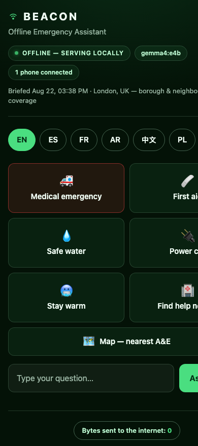
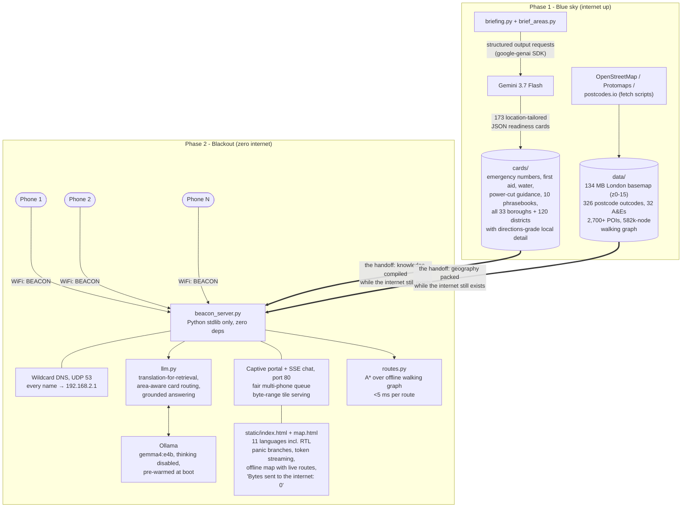

# Blackout Beacon

**When the grid dies, the cloud dies with it. Blackout Beacon turns one MacBook into a neighbourhood lifeline.**

The laptop broadcasts its own WiFi network, `BEACON`. Any phone joins it. No app, no account, no internet. Open a browser, type `beacon.help`, and you get a calm, multilingual emergency assistant that streams answers grounded in location-specific readiness material. Every name a phone asks for resolves to the laptop; every answer is generated on the laptop; zero bytes leave the room.

> The cloud teaches the laptop before the storm; the laptop carries the neighbourhood through it.

<p align="center"></p>

## At a glance

| | |
|---|---|
| **Knowledge** | 173 readiness cards compiled by Gemini 3.7 Flash — every one of London's 33 boroughs **plus 120 named districts**, each with A&Es, walking/bus directions, and local hazards |
| **Languages** | 11 full UI languages (EN·ES·FR·AR·中文·PL·RO·PT·TR·বাংলা·اردو, incl. right-to-left) — and questions are **understood in any language**: a local translation pass means asking about Stratford in Chinese finds the Stratford card |
| **Offline map** | Full London vector basemap (z0–15), postcode search across 326 outward codes, 32 curated A&Es, and **2,700+ pharmacies / defibrillators / police / fire stations** as toggleable layers |
| **Real routing** | Street-following walking routes from a 582k-node offline graph of Greater London, computed **in under 5 ms** on-device, drawn on the map with exact durations |
| **Zero infrastructure** | Wildcard DNS + captive portal: phones join the WiFi and any typed address lands on the beacon. No app, no account, no internet, no dependencies — the server is Python stdlib only |
| **Multi-phone** | Fair one-at-a-time queue with live position updates; model pre-warmed at boot so the first question streams instantly |
| **Tested** | ~130-check QA matrix ([QA-REPORT.md](QA-REPORT.md)), field-tested on real phones over the real hotspot |

## Why this exists

Storms, floods and substation fires take down power and connectivity together. Storm Éowyn left hundreds of thousands of UK and Irish homes without power; some spent days with no mains, no broadband, and mobile masts on dying backup batteries. At exactly the moment people most need to ask "is my insulin still safe?", "can I drink the tap water?", "where is the nearest warm bank?", every cloud AI on earth becomes unreachable. ChatGPT, Gemini, Claude: all of them share a single point of failure, which is the connection to them.

Local models fix the inference problem but not the knowledge problem: a small offline model does not reliably know your local emergency numbers, your nearest hospitals, or your water company's boil-notice procedure. Blackout Beacon splits the job in two:

- **Before the blackout**, while the internet still exists, a frontier cloud model compiles everything a neighbourhood will need into compact, structured "readiness cards".
- **During the blackout**, a small local model answers questions grounded in those cards, served from the laptop to every phone in WiFi range.

One charged MacBook has hours of battery and can serve a street. That is the whole idea.

## Quickstart

Prerequisites: macOS, [Ollama](https://ollama.com) installed, Python 3.10+, a Gemini API key (only needed for the online phase).

```bash
# 1. Pull the local model (once, while online)
ollama pull gemma4:e4b

# 2. Compile the readiness cards (while online; needs GEMINI_API_KEY in .env)
python3 briefing.py          # core cards + phrasebooks
python3 brief_areas.py       # optional: the 153-card London borough/district expansion

# 3. Fetch the offline map basemap (while online; 134 MB, too big for git)
#    One command - see data/README.md

# 4. Start the beacon (DNS on UDP 53 and HTTP on port 80 need root)
sudo ./run.sh
#    Dev mode without root:  BEACON_HTTP_PORT=8090 BEACON_DNS=0 python3 beacon_server.py

# 5. Broadcast the WiFi network
#    Follow HOTSPOT.md: System Settings > General > Sharing > Internet Sharing,
#    share from a dead interface (e.g. Thunderbolt Bridge) to WiFi,
#    network name BEACON, WPA2/WPA3, password beacon123.
```

Then on any phone: join **BEACON**, open a browser, go to **http://beacon.help** (or any domain at all; the captive DNS answers every name). If the browser insists on HTTPS or the phone is being difficult, `http://192.168.2.1` always works.

Note for macOS 26: Internet Sharing refuses a source interface with no link. The `feth` fake-cable workaround is documented under [Field notes](#field-notes) below and in `HOTSPOT.md`.

## Architecture

Two phases, two models, one handoff artefact: the cards.



**Blue-sky phase.** `briefing.py` and `brief_areas.py` call Gemini 3.7 Flash through the official `google-genai` SDK with structured outputs (typed Pydantic schemas enforced server-side), and write **173 location-tailored JSON readiness cards** into `cards/`: UK emergency numbers, first aid, water safety, power-cut guidance, 10 translated phrasebooks, and a help-points card for **every London borough (33) and 120 named districts** — each with hospitals, addresses, and walking/bus directions from local stations. Alongside the knowledge, fetch scripts pack the geography: the full London vector basemap, postcode centroids, curated A&E coordinates, 2,700+ emergency POIs from OpenStreetMap, and a compressed 582k-node walking graph. This is knowledge distillation with a deadline: the cloud's world knowledge is frozen into files while the connection to it still exists.

**Blackout phase.** `beacon_server.py` is deliberately Python-stdlib-only, zero dependencies, because a disaster tool must not have a supply chain. One process runs a wildcard DNS server on UDP 53 that answers every query with `192.168.2.1` (this is what makes `beacon.help`, and any other typed domain, just work), a captive-portal HTTP server on port 80 with byte-range serving for map tiles, an SSE streaming chat API with a fair one-at-a-time queue so several phones share one laptop's inference without trampling each other, and the offline routing engine (`routes.py`, A* over the packed walking graph, under 5 ms per route). `llm.py` does the clever retrieval: questions asked in *any* language get a fast local translation pass so the English card index still matches (ask about Stratford in Chinese, get the Stratford card), an area-router picks exactly one borough/district card from place-name evidence, and Gemma 4 (`gemma4:e4b` via Ollama, thinking disabled, pre-warmed at boot) streams an answer grounded strictly in the selected cards — in the user's language. The phone UI is two self-contained files: `index.html` (11 languages including right-to-left Arabic and Urdu, panic buttons that open *specific* sub-options rather than firing generic prompts, live token streaming, and a running "Bytes sent to the internet: 0" counter — not a joke, the product guarantee) and `map.html` (postcode search, nearest A&Es, real walking routes drawn on the offline basemap, POI layers).

The WiFi access point itself is macOS Internet Sharing, sharing *from* a deliberately dead interface, because the blackout has no upstream and we want the demo to be honest about that.

## Model usage

For the judges, explicitly:

| Model | Where it runs | What it does | How it is called |
|---|---|---|---|
| **Gemini 3.7 Flash** | Google cloud, **before** the blackout | Compiles all **173 readiness cards** — core emergency guidance, 10 translated phrasebooks, and the 153-card borough/district expansion — via structured outputs (typed Pydantic `response_schema`, enforced server-side, `response.parsed` returns validated objects) | Official `google-genai` SDK from `briefing.py` / `brief_areas.py`; model id discovered at runtime via `models.list()` |
| **Gemma 4 (e4b / 12b)** | **Fully local** on the laptop, **during** the blackout | All offline inference: every user-facing answer (grounded in the cards, streamed token by token, answered in the user's language) **plus** the translation-for-retrieval pass that lets non-English questions hit the English card index | Ollama (`gemma4:e4b`), thinking disabled (`"think": false`) for latency, via `llm.py` |

No user question ever reaches Gemini. Gemini's only role is authoring the cards while the internet is up. Once the blackout starts, Gemma 4 via Ollama is the only model in the loop, and the beacon works with the WiFi card as its entire network.

## Testing

[QA-REPORT.md](QA-REPORT.md) documents a ~130-check matrix run against the final build: full API contract, all 11 languages end-to-end (script-verified answers, grounding correctness through the translation layer), 20 area-routing cases, multi-phone queue behaviour, captive-portal rules, byte-range tile serving, malformed-input fuzzing (one crash found and fixed), and mid-stream disconnect resilience. The network layer (AP, captive DNS, portal, real Android quirks) was field-tested on physical phones over the actual hotspot — see Field notes.

## Repository guide

| Path | What it is |
|---|---|
| `beacon_server.py` · `llm.py` · `routes.py` | The blackout-phase stack: portal server, grounded answering, offline routing (stdlib only) |
| `briefing.py` · `brief_areas.py` | The blue-sky phase: Gemini structured-output card compilation |
| `static/index.html` · `static/map.html` | The two phone-facing pages, fully self-contained |
| `cards/` | All 173 readiness cards + `meta.json` |
| `data/` | Map stack: basemap (regenerate per `data/README.md`), postcodes, hospitals, POIs, walking graph |
| `tools/` | Blue-sky fetch/build scripts (POIs, walking graph) |
| `evidence/` | Replayable briefing recording (`script -p evidence/briefing-run.rec`) + generation logs |
| `HOTSPOT.md` · `DEMO.md` · `QA-REPORT.md` · `WRITEUP.md` | Hotspot playbook, demo script, test report, submission write-up |

## Field notes

Real findings from building and testing this today, presented as engineering evidence rather than polish:

- **University WiFi client isolation.** The venue network silently drops client-to-client traffic, so a phone could never reach the laptop over shared WiFi. Useless for testing, but accidentally a good argument for the product: you cannot rely on infrastructure you do not control. All real testing happened on the BEACON hotspot itself.
- **macOS 26 refuses link-less sharing sources.** Internet Sharing now checks that the source interface has an active link before it will start, which defeats "share from a dead interface" on purpose-built blackout hardware. Workaround: create a pair of `feth` (fake ethernet) interfaces and peer them, which is a virtual patch cable that gives the source interface a live link with nothing behind it:

  ```bash
  sudo ifconfig feth0 create && sudo ifconfig feth1 create && \
  sudo ifconfig feth0 peer feth1 && sudo ifconfig feth0 up && sudo ifconfig feth1 up
  ```

  This is a workaround, not a feature. We document it because pretending the OS cooperated would be dishonest, and because anyone reproducing this on macOS 26 will hit the same wall.
- **Samsung Android probes connectivity HTTPS-first.** Some Samsung builds check for captive portals over HTTPS before HTTP, and a local HTTP-only portal cannot answer an HTTPS probe without a trusted certificate, so the automatic "sign in to network" popup never fires on those phones. Mitigation: the wildcard DNS means the user can type literally any domain (`beacon.help` is just the one we print) and land on the beacon, and the demo includes a QR code straight to it. The popup is a convenience, not the mechanism.
- **Android needs a plain-DNS fallback.** Android's Private DNS (DNS-over-TLS) tries port 853 first; the beacon lets that fail fast so the phone falls back to plain UDP 53, where the wildcard answer is waiting. Without letting the encrypted attempt fail quickly, name resolution hangs long enough for users to give up.

## Limitations and roadmap

Current limitations, honestly:

- One laptop, one radio: range is one WiFi cell, roughly a house and its neighbours, not a district.
- Captive-portal popups fire on iOS and most Androids, but not all (see Field notes); the DNS wildcard and QR code are the reliable path.
- Cards are only as fresh as the last blue-sky run; a briefing compiled in summer will not know about this winter's flood wardens.
- Inference throughput is one conversation at a time by design; a queue is fair but not fast at scale.

Roadmap:

- **Beacon mesh**: multiple laptops or Pis, each a beacon, sharing cards over ad-hoc links so a street becomes a coverage patchwork.
- **Solar and battery profiles**: power-budget modes that trade model size and screen-off operation for runtime.
- **Pre-briefed regional packs**: downloadable card sets per region and season, compiled centrally while the internet is healthy, so a beacon can be useful even if its owner never ran `briefing.py`.
- **Raspberry Pi port**: the stdlib-only server already has no macOS dependencies; the AP layer and a smaller Gemma variant are the work.
- **Per-vendor captive-portal coverage**: a tested matrix of which phone builds pop the portal automatically, and vendor-specific nudges for the rest.

## Licence

MIT. See [LICENSE](LICENSE).
